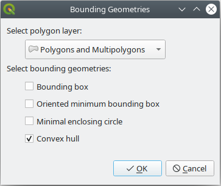
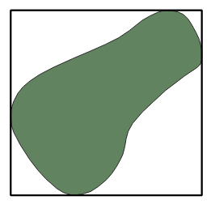
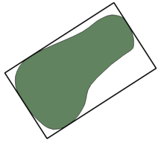
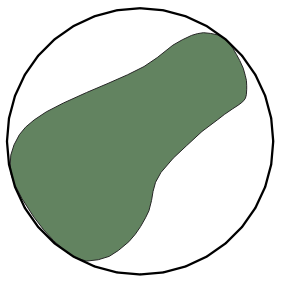
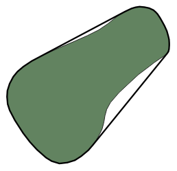
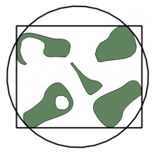
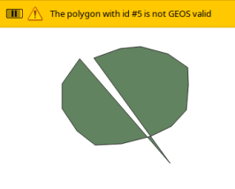

#Bounding Geometries v0.1

**Bounding Geometries** is a plugin for QGIS that will calculate four types of minimum bounding geometries, namely: bounding box, oriented minimum bounding box, minimal enclosing circle and convex hull.

Installation
------------
Use the QGIS plugin manager or unzip the downloaded bounding_geometries.zip from the QGIS [plugin repository](http://plugins.qgis.org/plugins/bounding_geometries) into your plugins directory.

Usage
-----
* Click on  to launch the plugin
* Select the layer containing the polygons
* Select the boundary geometries you need/want. A new **in-memory** layer called *Bounding Geometries* will be created holding the geometries
* The plugin will calculate the selected geometries for all the polygons in the layer

Bounding Geometries Graphical Description
--------------------------- 
**Bounding Box**

**Oriented Minimum Bounding Box**

**Minimal Enclosing Circle**

**Convex Hull**

Multipart Polygons
------------------
The plugin works on multipart polygons: 

Unvalid Geometry Polygons
------------------
If a polygon is not geometrically valid (after the [GEOS](https://libgeos.org/) library), the plugin will skip it and continue with the rest of polygons. Note that the plugin won't crash if such event happens, but a warning message will be displayed:

Spatial Reference
-----------------
The plugin will calculate the bounding geometries for projected and non-projected coordinate systems.
